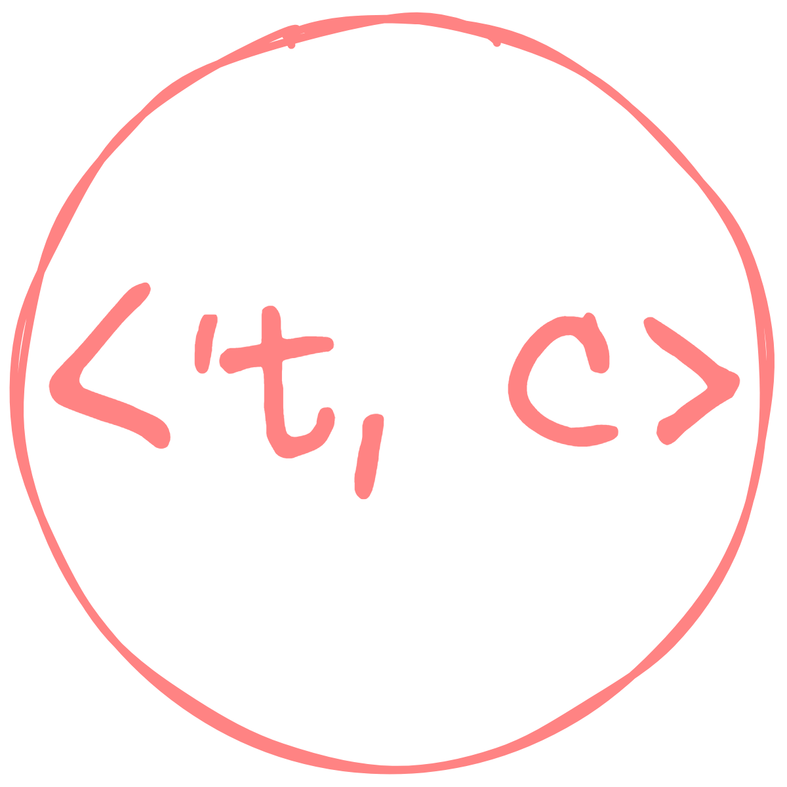

# truconsts

[](https://github.com/jymchng/truconsts/actions)
[](https://codecov.io/gh/jymchng/truconsts/)
[](https://choosealicense.com/licenses/mit/)
[](https://pypi.org/project/truconsts)
[](https://pypi.org/project/truconsts/#files)
[](https://pypi.org/project/truconsts/#files)
[](https://pypi.org/project/truconsts/#files)
[](https://github.com/jymchng/truconsts/)
[](https://git.embl.de/larralde/truconsts/)
[](https://github.com/jymchng/truconsts/issues)
[](https://truconsts.readthedocs.io)
[](https://github.com/jymchng/truconsts/blob/master/CHANGELOG.md)
[](https://pepy.tech/project/truconsts)


<div align="center" height=1000, width=200>
<br>

</div>

## Version: 0.0.8

`truconsts` is a constants management package for Python applications.

It provides a base class named `BaseConstants` which the user can subclass to achieve certain behaviours when accessing the class variables defined in the subclass. It also provides three classes that are meant for type-hinting, `Immutable`, `Yield` and `Cache`.

These three type-hinting classes do the following to the class variable:

`Immutable`: The class variable annotated with `Immutable` is immutable. Its value cannot be changed, any assignment to the class variable will raise an `AttributeError`.

`Yield`: The class variable annotated with `Yield` will always return/yield a value whenever the class variable is accessed. You can assign a function, 

`Cache`: The class variable annotated with `Cache` will always cache the yielded/returned value from the first call to the function/generator/asynchronous generator (alias: async-gen). Subsequent accesses to the class variable will return the cached value.

# Installation

You can use pip to install this package
```
pip install -U truconsts
```

# Usage

## If you want immutable constants
```python
from truconsts.constants import BaseConstants
from truconsts.annotations import Immutable

class MyConstants(BaseConstants):
    # annotate with `Immutable`
    MyImmutable: Immutable = "Cannot Be Changed"
    
try:
    MyConstants.MyImmutable = "Let's change"
except AttributeError as err:
    print(err)
# prints `MyConstants.MyImmutable` cannot be mutated
```

## If you want cached constants
'cached' constants refer to constants which are first 'gotten' through a function call and subsequent use of these constants need not be accessed through that function call.
```python
import time
import datetime

def get_from_network():
    time.sleep(2)
    return 'Going to cache'

class MyConstants(BaseConstants):
    # annotate with `Cache`
    MyCache: Cache = get_from_network
    
start = datetime.datetime.now()
MyConstants.MyCache
end = datetime.datetime.now()
print(f"Time taken to access the variable: {end-start}")
# Time taken to access the variable: 0:00:02.000991

start = datetime.datetime.now()
MyConstants.MyCache
end = datetime.datetime.now()
print(f"Time taken to access the variable after caching: {end-start}")
# Time taken to access the variable after caching: 0:00:00.000999
```

## If you want 'yielding' constants
'yielding' constants refer to constants (which are not 'really' constants in the strictest sense, but it's Python yeah...) to always generate a new value whenever you access them.
```python
import random

def gen():
    while True: # this while loop is import 
        # if you always want a random number
        # to be generate from this generator
        num = random.randint(0, 100)
        yield num
    
class MyConstants(BaseConstants):
    # annotate with `Yield`
    RANDOM_INT: Yield = gen 
    
print(MyConstants.RANDOM_INT) # 23
print(MyConstants.RANDOM_INT) # 88
```

## If you want 'yielding' constants from an asynchronous generator
Same as the above, but now with asynchronous generator. It makes your generators run as if they are synchronous.
```python
async def gen():
    i = 1
    while i:
        yield i
        i += 1

async def getter():
    async_asend_gen = gen()
    while True:
        num = await async_asend_gen.asend(None)
        yield num
    
class MyConstants(BaseConstants):
    COUNT_UP: Yield = getter()
    
print(MyConstants.COUNT_UP) # 1
print(MyConstants.COUNT_UP) # 2
print(MyConstants.COUNT_UP) # 3
print(MyConstants.COUNT_UP) # 4
```

## If you want a mix of constants
```python
# Simple API, just subclass `BaseConstants`
class Constants(BaseConstants):
    # `NUM` is an immutable `int`, i.e. Constants.NUM will always be 123
    NUM: Immutable[int] = 123
    # No `Immutable` annotation implies Constants.STR is mutable
    STR: str = "Hello"
    # Constants.IMMU_FUNC will call `get_constant` function; the returned value is cached
    # and it is immutable
    IMMU_FUNC: Cache[Immutable] = get_constant
    # Order/Subscripting of annotation does not matter
    MUT_FUNC: Immutable[Cache] = get_constant
    # Only `Cache` annotation without `Immutable` means it is mutable even after
    # the returned value is cached after being called for the first time
    JUST_CACHE: Cache[str] = get_constant
    # No annotation means it is neither `Cache` nor `Immutable`
    NO_ANNO = "NO_ANNO"
```

## Finally, if you want to manage your own asynchronous generator but want the 'reference' to it to be immutable
```python
async def gen():
    i = 1
    while i:
        stop = yield i
        if stop == True:
            print("Someone asked me to stop!")
            return
        i += 1

async def getter():
    async_asend_gen = gen()
    num = None
    while True:
        i = await async_asend_gen.asend(num)
        num = yield i

class MyConstants(BaseConstants):
    INT: Immutable = getter()
    
print(await MyConstants.INT.asend(None)) # 1
print(await MyConstants.INT.asend(None)) # 2
print(await MyConstants.INT.asend(None)) # 3
print(await MyConstants.INT.asend(None)) # 4
print(await MyConstants.INT.asend(True)) # Someone asked me to stop!;
# Raises `RuntimeError: async generator raised StopAsyncIteration``
```
There are more examples in the `examples` folder on Github.

# Roadmap

|Description|Progress|Code Sample|
|:--|:--:|:--:|
|Subclassing e.g. `Immutables` make all subclass' class variables immutable||[1]|
|Able to define inner class in outer class definition and declare annotation through parameters passed into class call||[1]|

## Samples

### [1]
```python
# Future APIs

class MyConstants(BaseConstants):
    
    class FilePaths(Immutables, this_class_as=(Immutable,)):
        # All `TRAINING`, `TESTING` class variables will be `Immutable`.
        # The class variable `FilePaths` of `MyConstants`
        # will be immutable as well.
        TRAINING = "."
        TESTING = ".."
        VALIDATION = "..."
        
    class Yielders(Yields):
        # Same as above just that all class variables will be
        # `Yield` annotated but `Yielders` will be mutable
        FIRST = gen
```
# Contributing
Contributions are welcome!