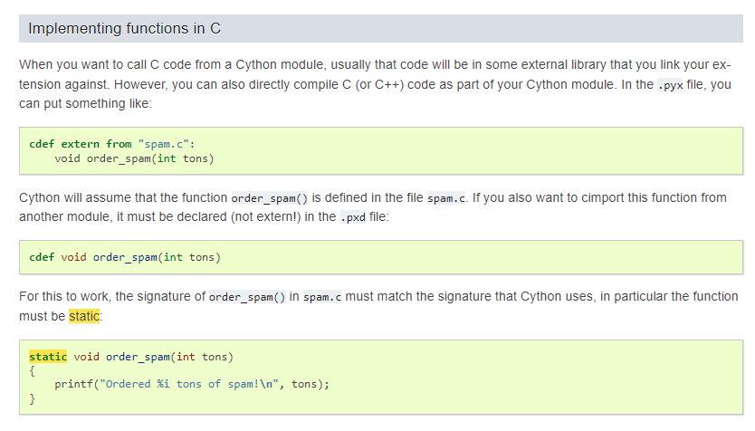

# VERY MESSY as it contains ad-hoc trials and reasonings!

# Learning One

Always `git remote` the repo first!

# Learning Two

The following is necessary in `pyproject.toml` if want to have `cy_src` containing cython files and a separate directory `truconsts` containing python files.

```
packages = ["truconsts", "cy_src"]
```

# Learning Three

Wasted a lot of time on this because thought got bug, but the bug is with PYPI Test.

Need to include `--extra-index-url`, like so:

```
pip install -U --index-url https://test.pypi.org/simple/ --extra-index-url https://pypi.org/simple truconsts
```

Or else will have error, like so:

```
$ pip install -i https://test.pypi.org/simple/ truconsts==0.0.5
Looking in indexes: https://test.pypi.org/simple/
Collecting truconsts==0.0.5
  Using cached https://test-files.pythonhosted.org/packages/c1/05/7a8f01fdc68e1783561d3f667a7e4b61b3cc04616b7774d7fc338e0ccc53/truconsts-0.0.5.tar.gz (49 kB)
  Installing build dependencies ... error
  error: subprocess-exited-with-error

  × pip subprocess to install build dependencies did not run successfully.
  │ exit code: 1
  ╰─> [6 lines of output]
      Looking in indexes: https://test.pypi.org/simple/
      ERROR: Could not find a version that satisfies the requirement setuptools (from versions: none)
      ERROR: No matching distribution found for setuptools
     
      [notice] A new release of pip is available: 23.0.1 -> 23.1.2
      [notice] To update, run: python.exe -m pip install --upgrade pip
      [end of output]

  note: This error originates from a subprocess, and is likely not a problem with pip.
error: subprocess-exited-with-error

× pip subprocess to install build dependencies did not run successfully.
│ exit code: 1
╰─> See above for output.

note: This error originates from a subprocess, and is likely not a problem with pip.

[notice] A new release of pip is available: 23.0.1 -> 23.1.2
[notice] To update, run: python.exe -m pip install --upgrade pip
```

# Learning Four

1. In Cython, when declaring functions, all `PyObject *` can be replaced by `object`, all other pointer objects have to be declared as pointers. E.g.

In `genobject.pxd`
```
object PyGen_NewWithQualName(PyFrameObject *frame, object name, object qualname)
# Return value: New reference.
# Create and return a new generator object based on the frame object, with
# __name__ and __qualname__ set to name and qualname. A reference to frame
# is stolen by this function. The frame argument must not be NULL.
```

Only functions/structs that are in `genobject.h` are exposed
```
PyObject *
PyGen_NewWithQualName(PyFrameObject *f, PyObject *name, PyObject *qualname)
{
    return gen_new_with_qualname(&PyGen_Type, f, name, qualname);
}
```

Another example...
In `object.pxd`
```
ctypedef struct PyTypeObject:
    const char* tp_name
    const char* tp_doc
    Py_ssize_t tp_basicsize
    Py_ssize_t tp_itemsize
    Py_ssize_t tp_dictoffset
    unsigned long tp_flags

    newfunc tp_new
    destructor tp_dealloc
    traverseproc tp_traverse
    inquiry tp_clear
    freefunc tp_free

    ternaryfunc tp_call
    hashfunc tp_hash
    reprfunc tp_str
    reprfunc tp_repr

    cmpfunc tp_compare
    richcmpfunc tp_richcompare

    PyTypeObject* tp_base
    PyObject* tp_dict

    descrgetfunc tp_descr_get
    descrsetfunc tp_descr_set
```

In `typestruct.h`
```
typedef struct _typeobject {
    PyObject_VAR_HEAD
    const char *tp_name; /* For printing, in format "<module>.<name>" */
    Py_ssize_t tp_basicsize, tp_itemsize; /* For allocation */

    /* Methods to implement standard operations */

    destructor tp_dealloc;
    Py_ssize_t tp_vectorcall_offset;
    getattrfunc tp_getattr;
    setattrfunc tp_setattr;
    PyAsyncMethods *tp_as_async; /* formerly known as tp_compare (Python 2)
                                    or tp_reserved (Python 3) */
    reprfunc tp_repr;

    /* Method suites for standard classes */

    PyNumberMethods *tp_as_number;
    PySequenceMethods *tp_as_sequence;
    PyMappingMethods *tp_as_mapping;

    /* More standard operations (here for binary compatibility) */

    hashfunc tp_hash;
    ternaryfunc tp_call;
    reprfunc tp_str;
    getattrofunc tp_getattro;
    setattrofunc tp_setattro;

    /* Functions to access object as input/output buffer */
    PyBufferProcs *tp_as_buffer;

    /* Flags to define presence of optional/expanded features */
    unsigned long tp_flags;

    const char *tp_doc; /* Documentation string */

    /* Assigned meaning in release 2.0 */
    /* call function for all accessible objects */
    traverseproc tp_traverse;

    /* delete references to contained objects */
    inquiry tp_clear;

    /* Assigned meaning in release 2.1 */
    /* rich comparisons */
    richcmpfunc tp_richcompare;

    /* weak reference enabler */
    Py_ssize_t tp_weaklistoffset;

    /* Iterators */
    getiterfunc tp_iter;
    iternextfunc tp_iternext;

    /* Attribute descriptor and subclassing stuff */
    struct PyMethodDef *tp_methods;
    struct PyMemberDef *tp_members;
    struct PyGetSetDef *tp_getset;
    // Strong reference on a heap type, borrowed reference on a static type
    struct _typeobject *tp_base;
    PyObject *tp_dict;
    descrgetfunc tp_descr_get;
    descrsetfunc tp_descr_set;
    Py_ssize_t tp_dictoffset;
    initproc tp_init;
    allocfunc tp_alloc;
    newfunc tp_new;
    freefunc tp_free; /* Low-level free-memory routine */
    inquiry tp_is_gc; /* For PyObject_IS_GC */
    PyObject *tp_bases;
    PyObject *tp_mro; /* method resolution order */
    PyObject *tp_cache;
    PyObject *tp_subclasses;
    PyObject *tp_weaklist;
    destructor tp_del;

    /* Type attribute cache version tag. Added in version 2.6 */
    unsigned int tp_version_tag;

    destructor tp_finalize;
    vectorcallfunc tp_vectorcall;

    /* bitset of which type-watchers care about this type */
    char tp_watched;
} PyTypeObject;
```

Sometimes if no need to declare attributes, can just `pass`, like so:
```
    ctypedef struct PyInterpreterState:
        pass

    ctypedef struct PyThreadState:
        pass

    ctypedef struct PyFrameObject:
        pass
```

# Learning Five

`Py_UNUSED` definition is here: https://github.com/python/cpython/blob/13237a2da846efef9ce9b93fd4bcfebd49933568/Include/pymacro.h#L114

If type of argument `Py_UNUSED` declared in function is `void *`, can simple use `NULL` as a parameter.

Example:
`coro_get_cr_await`
Function definition: https://github.com/python/cpython/blob/13237a2da846efef9ce9b93fd4bcfebd49933568/Objects/genobject.c#L1093
How it is used: https://github.com/python/cpython/blob/13237a2da846efef9ce9b93fd4bcfebd49933568/Objects/genobject.c#L1093

# Learning Six

The `.h` header file contains forward-declarations e.g. https://github.com/python/cpython/blob/13237a2da846efef9ce9b93fd4bcfebd49933568/Include/cpython/genobject.h#LL75C24-L75C38 for the definitions in `.c` source file, e.g. https://github.com/python/cpython/blob/13237a2da846efef9ce9b93fd4bcfebd49933568/Objects/genobject.c#L1664

# Learning Seven



Reference: https://cython.readthedocs.io/en/latest/src/userguide/external_C_code.html?highlight=static#implementing-functions-in-c

To import a `.c` into Cython, must do the following:

1. Must be `cdef extern from "sage/graphs/cliquer/cl.c":` `.c` instead of `cdef extern from "sage/graphs/cliquer/cl.h":` `.h`
2. Must add `cdef` in front of all declarations for all function that are declared as `static`
3. Need to have a way to refer to the exact `.c` file
4. Functions declared in for e.g. `genobject.h` are also declared (through the [#include "genobject.c"](https://github.com/python/cpython/blob/3.8/Include/Python.h#L121)) in `Python.h`
   hence it is possible to import functions like `PyGen_Check` that are declared in `genobject.h` using `cdef extern from "Python.h":`

Example: https://github.com/sagemath/sage/blob/3230f00aeb49802f99b0a3b76e770fa9d628c4e1/src/sage/graphs/cliquer.pyx#L38
```
cdef extern from "sage/graphs/cliquer/cl.c": # give the path to where they are
    cdef int sage_clique_max(graph_t *g, int ** list_of_vertices)
    cdef int sage_all_clique_max(graph_t *g, int ** list_of_vertices)
    cdef int sage_clique_number(graph_t *g)
    cdef int sage_find_all_clique(graph_t *g, int ** list_of_vertices, int min_size, int max_size)
```

```
int sage_clique_max(graph_t *g,int **list){
  sage_reset_global_variables();
  quiet++;
  set_t s;
  int i,l;
  clique_options *opts = sage_init_clique_opt();
  s=clique_unweighted_find_single(g,/*min_weight*/0,
				  /*max_weight*/0,/*maximal*/TRUE,
				  opts);
  free(opts);

  // Writing the answer into a int [] to be read by Sage
  int size=set_size(s);
  *list=malloc(sizeof(int)*size);
  l=0;
  for (i=0; i<SET_MAX_SIZE(s); i++) {
    if (SET_CONTAINS(s,i)) {
      *((*list)+l)=i;
      l++;
    }
  }
  return size;
}

int sage_all_clique_max(graph_t *g,int **list){
  sage_reset_global_variables();
  quiet++;
  maximal=TRUE;
  int i,j,l;

  clique_options *opts = sage_init_clique_opt();
  clique_unweighted_find_all(g,/*min_weight*/0,/*max_weight*/0,
			     maximal,opts);
  free(opts);

  int size=set_size(sage_clique_list[0]);
  *list=malloc(sizeof(int)*(size+1)*sage_clique_count);
  l=0;

  for (j=0; j<sage_clique_count; j++) {
    for (i=0; i<SET_MAX_SIZE(sage_clique_list[j]); i++) {
      if (SET_CONTAINS(sage_clique_list[j],i)) {
        *((*list)+l)=i;
        l++;
      }
    }
    set_free(sage_clique_list[j]);
    *((*list)+l)=-1;
    l++;
  }
  return (1+size)*sage_clique_count;
}
```

# Learning Eight

How to declare Python types (e.g. `PyAsyncGen_Type`) in Cython?
Encountered this error:

```
\truconsts\cy_src\constmeta.c(3051): error C2065: 'PyAsyncGen_TypeType': undeclared identifier
\truconsts\cy_src\constmeta.c(3051): error C2224: left of '.tp_as_async' must have struct/union type
```

Reference: https://cython.readthedocs.io/en/latest/src/userguide/extension_types.html#external-extension-types

Above didn't solve my problem.
```
from __future__ import print_function

cdef extern from "complexobject.h":

    #    typedef struct {
    #    double real;
    #    double imag;
    #} Py_complex;
    ctypedef struct Py_complex:
        double imag
        double real

    # PyAPI_DATA(PyTypeObject) PyComplex_Type; PyComplexObject
    ctypedef class __builtin__.complex [object PyComplexObject]:
        # note the `cdef` declaration because it is a `ctypedef class` declaration
        cdef Py_complex cval # `Py_complex` must be a value of `PyComplexObject` See `Error Two` below

# A function which uses the above type
def spam(complex c):
    print("Real:", c.cval.real)
    print("Imag:", c.cval.imag)
```

Reference: https://github.com/python/cpython/blob/3.8/Include/complexobject.h
```
typedef struct {
    double real;
    double imag;
} Py_complex;

typedef struct {
    PyObject_HEAD
    Py_complex cval;
} PyComplexObject;

PyAPI_DATA(PyTypeObject) PyComplex_Type;
```

Error Two: 
```
F:\py_projects\truconsts\cy_src\constmeta.c(3071): error C2039: 'tp_as_async': is not a member of 'PyAsyncGenObject'
C:\Users\Jym Chng.DESKTOP-N84UN90\AppData\Local\Programs\Python\Python310\include\genobject.h(64): note: see declaration of 'PyAsyncGenObject'
```

Reference: https://github.com/sagemath/sage/blob/3230f00aeb49802f99b0a3b76e770fa9d628c4e1/src/sage/cpython/builtin_types.pyx

```
from cpython.object cimport PyTypeObject

cdef extern from *:
    PyTypeObject PyWrapperDescr_Type

wrapper_descriptor = <type>(&PyWrapperDescr_Type)
```

Can just declare another `ctypedef` as `ctypedef`

Another Example: https://github.com/sagemath/sage/blob/3230f00aeb49802f99b0a3b76e770fa9d628c4e1/src/doc/en/developer/sage_manuals.rst#L240

```
cdef extern from "descrobject.h":
    ctypedef struct PyMethodDef:
        void *ml_meth
    ctypedef struct PyMethodDescrObject:
        PyMethodDef *d_method
    void* PyCFunction_GET_FUNCTION(object)
    bint PyCFunction_Check(object)
```

# Learning Nine

How to declare a type e.g. `PyComplex_Type` or `PyAsyncGen_Type` in Cython?

These types, `PyComplex_Type` or `PyAsyncGen_Type`, are not `typedef struct` etc, **THEY ARE VALUES OF `PyType_Object`**!

References: https://github.com/python/cpython/blob/d8ca5a11bc55e2a69cab4f8795d0a5aa6932a41b/Objects/genobject.c
```
PyTypeObject PyAsyncGen_Type = { # SEE THE `=` EQUAL SIGN!!!
    PyVarObject_HEAD_INIT(&PyType_Type, 0)
    "async_generator",                          /* tp_name */
    offsetof(PyAsyncGenObject, ag_iframe) +
    offsetof(_PyInterpreterFrame, localsplus),       /* tp_basicsize */
    sizeof(PyObject *),                         /* tp_itemsize */
    /* methods */
    (destructor)gen_dealloc,                    /* tp_dealloc */
    0,                                          /* tp_vectorcall_offset */
    0,                                          /* tp_getattr */
    0,                                          /* tp_setattr */
    &async_gen_as_async,                        /* tp_as_async */
    (reprfunc)async_gen_repr,                   /* tp_repr */
    0,                                          /* tp_as_number */
    0,                                          /* tp_as_sequence */
    ...
    ...
}    
```

The way to do this in Cython is:
1. Declare a `typedef struct` with any name that is NOT `PyAsyncGen_Type`, e.g. `PyAsyncGen_CyType`
2. Declare a value of the type whose name you declared in `typedef struct` of Step 1 but the name of the
   value of the type must be the name of the Python type (e.g. `PyAsyncGen_Type`), e.g. `cdef PyAsyncGen_CyType PyAsyncGen_Type`